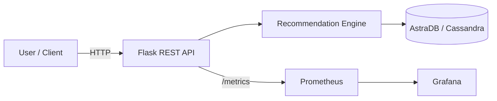

# Flipkart Product Recommender
*Flipkart-style product recommendation engine using LLMs, Grafana, MiniKube, and AstraDB*

[](LICENSE)
[](https://github.com/atul219/Flipkart-Product-Recommender/actions)

---

## 🧭 Table of Contents
1. [About](#-about)
2. [Features](#-features)
3. [Architecture & Components](#-architecture--components)
4. [Getting Started](#-getting-started)
   - [Prerequisites](#-prerequisites)
   - [Installation](#-installation)
   - [Configuration](#-configuration)
   - [Running Locally](#️-running-locally)
   - [Deploying to Kubernetes (MiniKube)](#️-deploying-to-kubernetes-minikube)
5. [Data & Model](#-data--model)
6. [Monitoring & Observability](#-monitoring--observability)
7. [Contributing](#-contributing)
8. [License](#-license)
9. [Acknowledgements](#-acknowledgements)

---

## 🧠 About
**Flipkart Product Recommender** is a prototype recommendation system that demonstrates how to build an e-commerce-style recommender using:
- **LLMs** for semantic embeddings
- **AstraDB (Cassandra)** for scalable storage
- **MiniKube/Kubernetes** for container orchestration
- **Prometheus + Grafana** for metrics and dashboards

Use it as a learning reference or extend it into a production-ready pipeline.

---

## ✨ Features
- 🛒 Product ingestion and metadata parsing (titles, categories, descriptions)
- 🧩 Embedding generation with LLMs for semantic similarity
- 🔍 Retrieval + ranking (cosine similarity by default; pluggable ANN)
- 🧰 REST API with Flask for serving recommendations
- 🗃️ Persistent storage in AstraDB (Cassandra compatible)
- 📈 Metrics via Prometheus and dashboards via Grafana
- 🐳 Docker + Kubernetes (MiniKube) deployment
- ⚙️ Configurable model/top-K/thresholds

---

## 🏗️ Architecture & Components



**Components**
- **Flask API** (`app.py`): Exposes endpoints (e.g., `/recommend`) and handles request/response.
- **Recommendation Engine** (`src/`): Embedding generation, similarity scoring, ranking logic.
- **Data** (`data/flipkart/`): Sample Flipkart-like catalog and metadata.
- **Database**: **AstraDB** stores product metadata and vector embeddings.
- **Observability** (`prometheus/`, `grafana/`): Prometheus scrapes metrics; Grafana visualizes KPIs.
- **Deployment**: `Dockerfile`, `flask-deployment.yaml` (K8s manifests).

---

## ⚙️ Getting Started

### 🧾 Prerequisites
- Python **3.12+**
- **Docker**
- **MiniKube** and **kubectl**
- **AstraDB** account (or local Cassandra)
- LLM API key (e.g., OpenAI or compatible endpoint)

### 💾 Installation
```bash
git clone https://github.com/atul219/Flipkart-Product-Recommender.git
cd Flipkart-Product-Recommender

pip install uv
uv venv --python 3.12
source venv/bin/activate

pip install -e .
```

### ⚙️ Configuration
Set environment variables or edit `config.yaml`:

- `ASTRA_DB_ID`, `ASTRA_DB_REGION`, `ASTRA_DB_KEYSPACE`, `ASTRA_DB_TOKEN`
- `LLM_API_KEY` (or local model endpoint)
- `PROMETHEUS_PORT` (metrics)
- Recommender params: `TOP_K`, `EMBED_DIM`, `SIMILARITY` (e.g., cosine)

> Tip: Provide an `.env.example` to help others configure quickly.

### ▶️ Running Locally
```bash
python app.py
```

Now open: http://localhost:5000

Health check:
```bash
curl http://localhost:5000/health
```

### ☸️ Deploying to Kubernetes (MiniKube)
Start cluster:
```bash
minikube start
```

Build image inside MiniKube:
```bash
eval $(minikube docker-env)
docker build -t flipkart-recommender:latest .
```

Deploy:
```bash
kubectl apply -f flask-deployment.yaml
```

Expose the service (option A: port-forward):
```bash
kubectl port-forward svc/flipkart-recommender 5000:5000
```

(Optional) Deploy Prometheus & Grafana manifests:
```bash
kubectl apply -f prometheus/
kubectl apply -f grafana/
```

---


### Endpoints (suggested)
- `GET /health` → service health
- `GET /metrics` → Prometheus metrics (if enabled)

---

## 🧩 Data & Model
- **Dataset**: `data/flipkart/` contains sample catalog. Replace with your own export (respecting source ToS).
- **Embeddings**: Generated from product title/description/category using an LLM.
- **Similarity**: Cosine distance by default. Swap in **FAISS**, **Annoy**, or **ScaNN** for ANN/large scale.
- **Storage**: Product vectors + metadata stored in **AstraDB**; keyed by product IDs.

> Extensions: hybrid signals (content + behavior), personalisation from clicks/purchases, session context, re-ranking with learning-to-rank.

---

## 📊 Monitoring & Observability
- **Prometheus** scrapes `/metrics` (request counts, latency histograms, DB timings, hit/miss).
- **Grafana** dashboards visualize KPIs and SLOs.
- Add **Alertmanager** rules for latency/error-rate thresholds.

Suggested metrics:
- `http_requests_total{endpoint=...}`
- `request_latency_seconds_bucket`
- `db_query_duration_seconds`
- `recommendation_hit_ratio`

---

## 🤝 Contributing
Contributions welcome!

1. Fork the repo
2. Create a feature branch: `git checkout -b feat/my-change`
3. Add tests/docs where relevant
4. Commit with clear messages
5. Open a Pull Request describing the change and rationale

Coding style:
- Keep modules small and cohesive
- Add docstrings and type hints where possible
- Prefer pure functions for core ranking logic

---

## 📜 License
This project is licensed under the [MIT License](LICENSE).

---

## 🙌 Acknowledgements
- [Grafana](https://grafana.com/)
- [Prometheus](https://prometheus.io/)
- [AstraDB](https://www.datastax.com/products/datastax-astra-db)
- [MiniKube](https://minikube.sigs.k8s.io/)
- LLM provider of your choice (Groq or compatible)

---


> _Made with ❤️ by [Atul219](https://github.com/atul219)_
